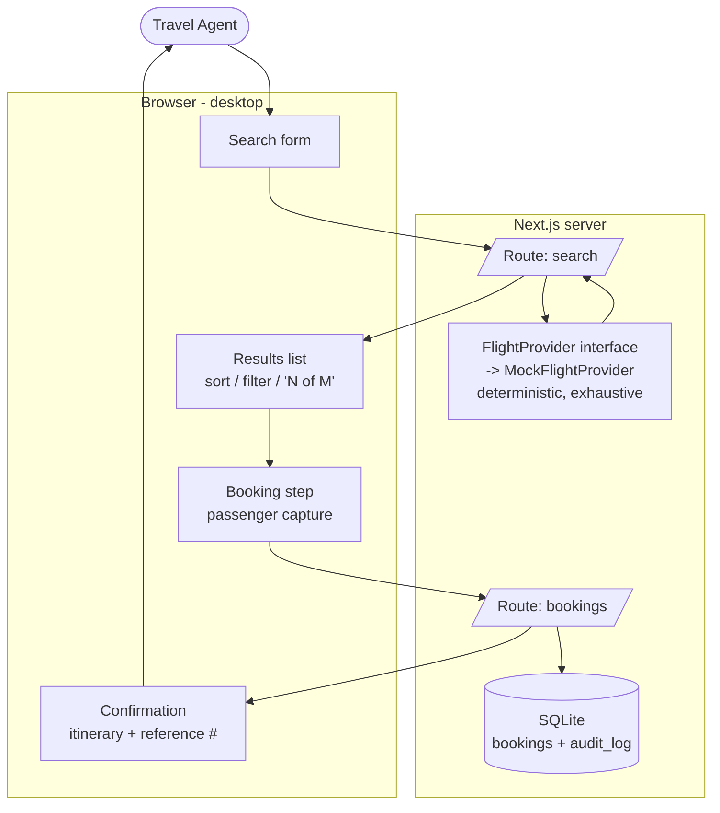

# High-Level Design: Travel Agency Flight Desk

## Problem

Our travel agents book flights for customers by tabbing between several airline and
GDS websites. This is slow, and — more importantly — agents are never confident they
have seen *every* option. There is no single place to enter a customer's trip, compare
the full set of flights, book one, and hand the customer a confirmation. Finance also
has no reliable record of what was booked.

We want one internal tool that owns the whole flow: search → compare → book → confirm,
with a hard guarantee that the agent has seen the complete set of options, and a durable
log of every booking for later reconciliation.

## Approach

A single Next.js (App Router, TypeScript) web application, desktop-first, for our own
agents on the internal network. Four load-bearing disciplines:

1. **Exhaustive, deterministic search.** Flight options come from a mock provider behind
   a clean `FlightProvider` interface. Given a search, the provider returns the *complete*
   candidate set for that route and date window — there is no pagination and no hidden
   tail. Because the set is known-complete, the UI can truthfully assert "showing all N
   options." Generation is deterministic (seeded by the search criteria) so the same
   search reproduces the same results — repeatability is itself a trust signal.

2. **Hide, never drop.** Sorting and filtering operate over the known-complete set on the
   client. Filters *hide* options from view but never remove them from the total; the UI
   always shows "N of M total" and offers a one-click "clear filters" to return to the
   full set. The agent can always prove to themselves that nothing was silently dropped.

3. **Booking as a first-class transaction.** Selecting an option opens a booking step that
   captures each passenger, then produces a confirmation containing the full itinerary,
   a price breakdown, and a unique booking reference number the agent can pass to the
   customer.

4. **Durable audit.** Every booking is written to SQLite alongside an append-only audit
   log entry, so finance can reconcile later.

The mock provider is deliberately isolated behind an interface so a real GDS/airline
integration can replace it without touching search UX, booking, or audit.

## Target Users

Internal travel agents, already authenticated on our network. They are trusted, repeat
users who value speed and, above all, confidence that they are seeing the complete set of
options before they commit a customer to a booking. They are not the traveling customer —
the customer receives only the confirmation the agent hands them.

## Goals

- An agent can enter a full trip search — origin, destination, dates, date flexibility,
  passenger count, cabin class, an optional price ceiling, and an optional corporate
  travel policy — and get back a comparable set of flight options.
- The agent can trust the set is complete: the UI states the total option count and
  guarantees filters only hide, never drop.
- Options are comparable at a glance: airline, departure/arrival times, stop count, total
  duration, a price breakdown, and estimated CO2 emissions — sortable (including by
  emissions) and filterable (including a non-stop-only toggle).
- The agent can select an option, capture passenger details, and book it.
- Booking produces a confirmation with the full itinerary and a unique reference number.
- Every booking is durably persisted and logged for finance reconciliation.

## Non-Goals

- **No authentication or user management.** Agents are already signed in on the internal
  network; the app treats its user as a single trusted internal actor.
- **No real airline/GDS integration in this MVP.** Flight data is mocked behind an
  interface. No real fares, seat inventory, or ticketing.
- **No payment processing.** Booking records the intent and the priced itinerary; it does
  not charge a card or issue a real ticket.
- **No customer-facing surface.** No public site, no customer login, no email delivery.
- **Not mobile-first.** Desktop is the priority.
- **No multi-agent collaboration, roles, or permissions** in this MVP.

## System Design

Single Next.js app. Server Route Handlers expose search and booking; the mock provider
and the SQLite persistence layer live server-side. The results comparison (sort/filter
over the known-complete set) happens client-side so it is instant and provably
non-dropping.

**Intent components (future arrow segments):**

- **SEARCH** — the search criteria model and form (route, dates, flexibility, passengers,
  cabin, price ceiling, corporate policy) and validation.
- **FLIGHTS** — the `FlightProvider` interface, the deterministic exhaustive mock, the
  option/price-breakdown model, and the completeness contract (total count, hide-not-drop).
- **BOOKING** — option selection, passenger capture, confirmation, reference-number
  generation.
- **AUDIT** — booking persistence and the append-only finance audit log.

Final segment boundaries are settled in Phase 2 (LLDs).

## Key Design Decisions

| Decision | Choice | Rationale | Alternatives considered |
|---|---|---|---|
| Trust mechanism | Single exhaustive source: provider returns the complete set; UI asserts "all N options" | For mocked MVP data, "this is literally all of them" is the strongest, simplest trust signal | Multi-source aggregation with per-source coverage status — richer, rehearses real-world partial coverage, but more complexity and a weaker MVP guarantee |
| Corporate policy | Flag non-compliant options, do not filter them out | Keeps the result set complete (serves the trust goal) while making policy violations visible; the agent decides | Hard filter (would hide options, contradicting hide-never-drop); ignore policy (loses the requirement) |
| Filtering semantics | Filters/sort hide and reorder only; never drop; always show "N of M total" | Agent can always prove nothing was silently removed — directly serves the trust goal | Server-side re-query per filter (risks appearing to "lose" options) |
| Result determinism | Deterministic generation seeded by search criteria | Same search reproduces same results; repeatability is a trust signal and makes testing tractable | Random generation per request (non-reproducible, untestable) |
| Provider isolation | Mock behind a `FlightProvider` interface | Real GDS can replace the mock without touching search UX, booking, or audit | Inline mock data (couples UI to mock shape, hard to swap) |
| Persistence | SQLite, bookings table + append-only audit_log table | Real relational store, zero infra, queryable by finance, migratable to Postgres later | JSON/JSONL files (weak querying, concurrent-write risk); hosted Postgres (infra overkill for MVP) |
| Auth | None; single trusted internal actor | Explicitly out of scope per the brief | App-level login (out of scope) |
| Stack | Next.js App Router + TypeScript + Tailwind, desktop-first | Matches the existing scaffold; one deployable; server + client in one place | Separate SPA + API backend (more parts than an MVP needs) |

## Success Metrics

- An agent completes search → compare → book → confirmation for a representative trip
  without leaving the tool.
- The results screen always displays an accurate total option count, and applying any
  combination of filters never changes that total (only the visible subset).
- Every completed booking has a corresponding row in both `bookings` and `audit_log`,
  with a reference number that appears on the confirmation and in the log.
- **Falsification signals (tool judged broken):** a filter removes an option from the
  total rather than hiding it; the same search yields different result sets on repeat; a
  booking succeeds with no audit-log row; a confirmation lacks a reference number or full
  itinerary.

## References

- `docs/llds/` — per-component low-level designs (to be drafted in Phase 2).
- `docs/specs/` — EARS specifications (Phase 3).
- Arrow of intent: `HLD → LLDs → EARS → Tests → Code` (see `CLAUDE.md`).
